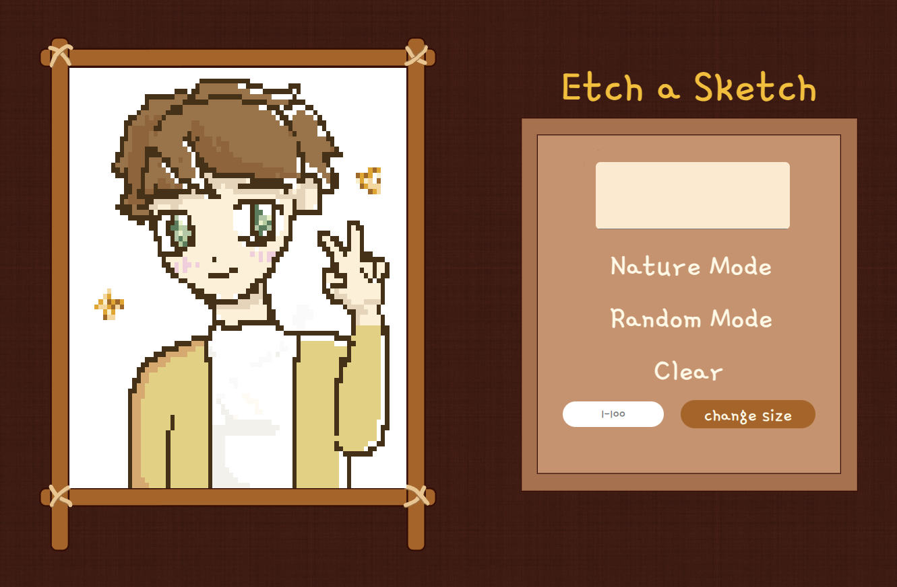

# 🎨 Etch-a-Sketch

Created a sketching game using JavaScript, HTML, and CSS. Users can draw by hovering over a customizable grid.

---

## 🕹️ Features

- Hover-to-draw pixel grid
- Adjustable grid size
- Multiple color modes
- Reset button
- Color picker

---

## 🧠 What I Practiced and Improved

- DOM manipulation (creating and adjusting elements dynamically)
- Event listeners (click, input, mouseover, etc.)
- Dynamically changing pixel/grid sizes
- Practiced using Flexbox for layout responsiveness

## 🖼️ Preview

